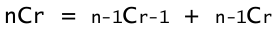
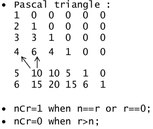
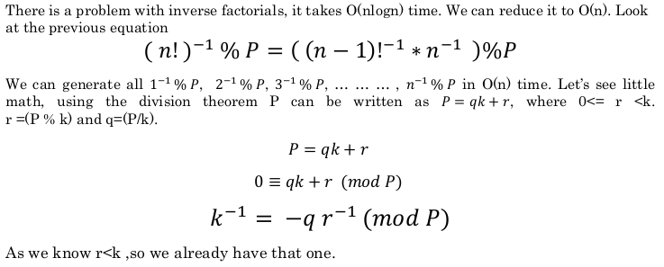
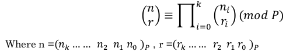

# Combinatorics
There are a lot of computational math problems that needs knowledge of combinatorics to solve. And it is often hard to interpret proper combinatorial relationships in problems. Most often these relations can be expressed in a recursive manner using lower order terms. This tutorial is produced to explain such relationships and calculations associated with those relations.

So, lets have a seat, grab a coffee and enjoy the rest.
<br />


## A Deep Dive into "Combination" or "Binomial Coefficient"
When it comes to combinatorics, we often face problems which includes calculation of combinations for objects, or arrangements, or combinations of path to reach a goal. Some of the problems want us to calculate the real value of combinations. And sometimes, we are asked to calculate the mod value with respect to a given number. When it comes to mod value, sometimes the given number is a prime, sometimes it's not. Whatever the problem is, we're going to calculate the value of nCr, as we need. This section is fully devoted to calculation of combinations.
<!-- <div style="text-align:center">
	
</div>
<br/>
 -->

*Basically this documentation represents the implementation techniques described in this [tutorial](https://youtu.be/1U3loHkX5XE) to calculate binomial coefficient(nCr).*<br />

Here, we've discussed four ways to calculate binomial coefficient:

- [Calculate nCr or nCr % P where n \* r <= 10^6](#calculate-ncr-or-ncr--p-where-nr--106)
- [Calculate nCr % P where P is a prime and n, r <= 10^6](#calculate--ncr--p--where-p-is-a-prime-and-0--n-r-106)
- [Calculate nCr % P where n,r <= 10^18 but P is prime and P <= 10^6](#calculate-ncr--p-where-0--n-r--1018-but-p-is-prime-and-0--p--106)
- [Calculate nCr % P with Chinese remainder theorem](#calculate-ncr--p-with-chinese-remainder-theorem)
<br />


### Calculate nCr or nCr % P where n \* r <= 10^6

The key idea to calculate the value nCr for this case is the properties of pascal's triangle. We are all familiar with the following formula:

<div style="text-align:center">
	
</div>
<br />

Let's take a look at the below pascal's triangle (bad looking one!), and figure out how the values of the triangle justify  the equation. In the below triangle, value at x'th row and y'th column represent the value of xCy.<br />

<div style="text-align:center">
	
</div>
<br />

**The advantage with this formula is you can modulo ans with any number even though the number isn’t prime. ( nCr % P)**


We can implement the idea explained above in both iterative and recuersive manner. An iterative implelentation is provided below:

```c
#include <bits/stdc++.h>
using namespace std;

#define maxn 50
#define maxr 40

long long C[maxn + 2][maxr + 2];

void triangle() {
	C[0][0] = 1;
	for (int i = 1; i <= maxn + 1; i++) {
		for (int j = 1; j <= i && j <= maxr + 1; j++) {
			C[i][j] = (C[i - 1][j - 1] + C[i - 1][j]);
		}
	}
}

long long nCr(long long n, long long r) {
	if (r > n) return 0;
	if (r == n || r == 0) return 1;
	return C[n + 1][r + 1];
}

int main() {
	triangle();
	cout << nCr(50, 33) << endl;
	return 0;
}
```

A recursive implementation is given below. But it is comparatively slower(very little) than the iterative implementation though both implementation has the same complexity.

```c
#include <bits/stdc++.h>
using namespace std;

#define maxn 50
#define maxr 40

long long C[maxn + 1][maxr + 1];

long long nCr(long long n, long long r) {
	if(r > n) return 0;
	if (r == n || r == 0) return 1;
	if (C[n][r]) return C[n][r];
	C[n][r] = nCr(n-1, r-1) + nCr(n-1, r); 
	return C[n][r];
}

int main() {
  cout << nCr(50, 33) << endl;
  return 0;
}
```
<br />


### Calculate  nCr % P , where P is a prime and 0 <= n, r <= 10^6.

<div style="text-align:center">
	
</div>
<br />

Now we will have to count `n!` and the inverse factorial of `(n-r)!r!` .. we can compute 
factorial values in linear time, i.e. in `O(n)` complexity.<br />

<div style="text-align:center">
	
</div>
<br />


```c 
long long fact[1000001];

fact[0] = 1;
for(int i = 1; i <= 1000000; i++) {
    fact[i] = (1LL * fact[i-1] * i) % P;
}
```

We’ve generated the values of `(n!) % P` for any n `(0 <= n <= 1000000)`. Now it’s time to count
the inverse factorials. We will learn two approaches. First I will go with the easy one.
<br />

<div style="text-align:center">
	
</div>
<br />

Now we will need the value of `(n^-1)! % P` to count inverse factorials. The way that shown here to calculate modular inverse is using [Fermat's little theorem](https://en.wikipedia.org/wiki/Fermat%27s_little_theorem) with the help of bigmod. Another way is using Extended GCD, popularly known as egcd.<br />

<div style="text-align:center">
	
</div>
<br />


So inverse factorials can be written as,  `ifact[i]= (ifact[i - 1] * inv(i)) % P`;

```c 
long long mpower(long long b, long long p, long long mod) {
	if(p == 0) return 1;
	long long tmp = mpower(b, p / 2, mod);
	tmp = (tmp * tmp) % mod;
	return ((p % 2) == 0) ? tmp : (b* tmp) % mod;
}

long long inv(long long n, long long mod) {
	return mpower(n, mod-2, mod);
}

long long ifact[1000001];

ifact[0] = 1;
for(int i = 1; i <= 1000000; i++) {
	ifact[i] = (1LL * ifact[i-1] * inv(i , P)) % P;
}

```

The complexity of this generation is `O(n log n)`. Actually it’s `O(n log P)`. The `inv( )` function takes
`log P` time to generate value.

Now as we have both factorials and inverse factorials. So its time to compute `nCr`.

```c 
long long nCr(long long n, long long r) {
	if(r > n) return 0;
	long long ans;
	ans = ((1LL * fact[n] * ifact[n-r]) % P * ifact[r]) % P;
	return ans;
}
```

<div style="text-align:center">
	
</div>
<br />

```c 
in[0] = 0, in[1] = 1;
for(int i = 2; i <= 1000000; i++) {
	in[i] = (1LL * ((P-1) * (P / i)) % P * in[P % i]) % P;
}

ifact2[0] = 1;
for(int i = 1; i <= 1000000; i++) {
	ifact2[i] = (1LL * ifact2[i-1] * in[i]) % P;
}
```
<br />


### Calculate nCr % P where 0 <= n, r <= 10^18 but P is prime and 0 <= P <= 10^6

To solve this problem we will need Lucas theorem. Because the Lucas theorem will reduce the problem to sub problems. In this theorem the n and r are converted to P base number and then we compute the same digit-location wise binomial coefficients. You can search about Lucas theorem to understand it more clearly. Lucas theorem is given below: <br/>

<div style="text-align:center">
	
</div>
<br/>

```c 
long long in[1000001], fact[1000001], ifact[1000001];

void generate(long long MX, long long P) {
	fact[0] = 1;
	for(int i = 1; i <= MX; i++) {
		fact[i] = (1LL * fact[i-1] * i) % P;
	}
	
	in[0] = 0; in[1] = 1;
	for(int i = 2; i <= MX; i++) {
		in[i] = (1LL * ((P-1) * (P / i)) % P * in[P % i] ) % P;
	}

	ifact[0] = 1;
	for(int i = 1; i <= MX; i++) {
		ifact[i] = (1LL * ifact[i-1] * in[i]) % P;
	}
}

long long small_nCr(long long n, long long r, long long P) {
	if(r > n) return 0;
	long long ans;
	ans = (1LL * fact[n] * ifact[n-r]) % P;
	ans = (ans * ifact[r]) % P;
	return ans;
}

long long nCr(long long n, long long r, long long P) {
	if(r == 0) return 1;
	long long ni = (n % P), ri = (r % P);
	return (nCr(n / P, r / P, P) * small_nCr(ni, ri, P)) % P;
}

long long Lucas(long long n, long long r, long long P) {
	generate(P, P);
	return nCr(n, r, P);
}

int main() {
	long long prime[] = {13, 29, 67, 113, 157, 223};

	for(int i = 0; i < 6; i++) {
		cout << (126 % prime[i]) << ' ' << Lucas(9, 5, prime[i]) << endl;
	}
	return 0;
}
```
<br />


### Calculate nCr % P with Chinese remainder theorem

Let's consider you need to calculate `nCr%P` where P isn't a prime. We can use `Chinese remainder 
theorem` to solve this problem. We can split P into its prime divisors and count binomial coefficients for each divisor and marge them using Chinese remainder theorem.<br />

<div style="text-align:center">
	
</div>
<br />

```c 
long long n, prime[20], rim[20];

long long bigMod(long long b, long long p, long long M) {
	if(p == 0)return 1;
	long long tmp = bigMod (b, p/2,M);
	tmp = (tmp * tmp) % M;
	return ((p % 2) == 0) ? tmp : ((b * tmp) % M);
}

long long INV(long long num, long long M) {
	return bigMod(num, M-2, M);
}

long long ChineseRemainder() {
	long long product = 1, x = 0, pd;
	for(int i = 0; i < n; i++) product *= prime[i];
	for(int i = 0; i < n; i++) {
		pd = product / prime[i];
		x += (rim[i] * pd * INV(pd, prime[i]));
		x %= product;
	}
	return x;
}
```